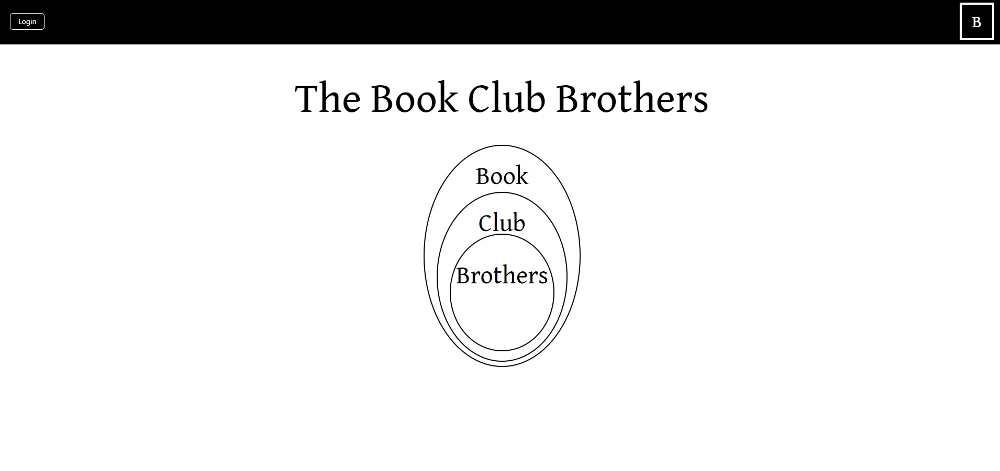

# BookClubBrothers_Frontend

The Book-Club Brothers is an exclusive book club formed of old school friends, who find themselves dotted all across the globe and are unable to meet in person. Therefore, we meet online instead and have been doing so since 11th October 2020 (the date our whatsapp group was created). 

We choose the books as a group, read them and then discuss - either over a warm cup of coffee or ice cold beer.

I finally decided to document our progress on a website with its own database, which is what brought me to this project.

For the Frontend I am using TypeScript with the React library and Tailwind CSS.

I am fetching from my own API which you can view here: https://github.com/DarrellRoberts/BookClubBrothers_Backend-API

This is my current project, a work in progress, so stay tuned for more screenshots and more!

Screenshots

**Homescreen**

**Secret Quiz on Loading Screen (appears if Render takes too long to fetch the data)**

Cheers,

Darrell
